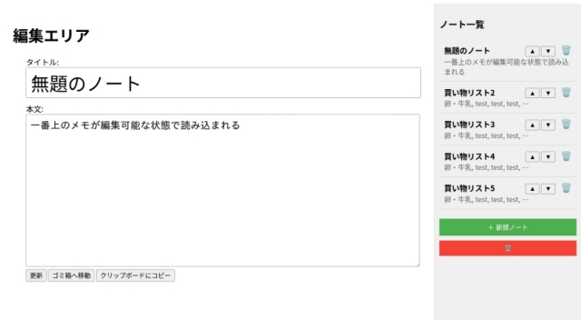

## **1. プロジェクト概要**
### **1.1. 概要**
本プロジェクトは「クラウド型メモアプリのプロトタイプ制作」というテーマで、Java開発の実務における工程の実践と学習を目的としています。

### **1.2. 開発手法・技術**
- **エディタ**: Spring Tools Suite 4 (Eclipse)
- **CIツール**:
  - GitHub Actions (作業ブランチからのプルリクマージ時に自動テストを実行)
  - JacocoとCodecovによるテストカバレッジ率の可視化
- **その他開発手法**:
  - テスト駆動開発の部分的実践
  - ViewはThymeleafで実装、伝統的MVCアーキテクチャに基づいた設計

---
## **2. 実用化に向けた課題**
- **機能追加**:
  - 自動保存
  - マークアップ表記への対応
- **セキュリティ強化**: データベースに保存するメモの暗号化
- **モバイルアプリ化**: RESTエンドポイントを追加し、複数のプラットフォームからアクセス出来るようにする
- **UI改善**:

---
